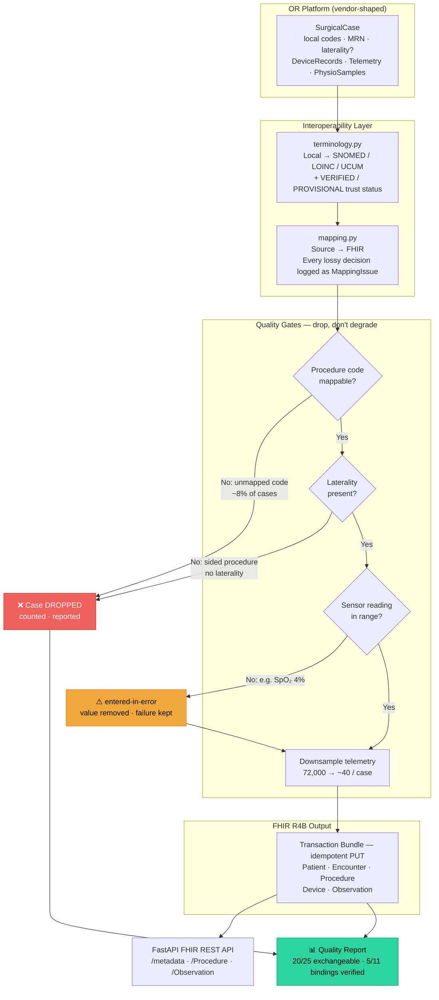

# Surgical RAS → FHIR R4B Interoperability Pipeline


> A transparent, governance-first pipeline that maps **robotic-assisted surgery (RAS) telemetry** to **FHIR R4B** clinical exchange format — and reports honestly on what breaks along the way.

**[▶ Live Interactive Demo](https://smahanti8.github.io/surgical-fhir-pipeline/)** &nbsp;·&nbsp; [Architecture decisions](DECISIONS.md) &nbsp;·&nbsp; [Sample quality report](docs/sample-quality-report.txt)

---

## At a glance

| Metric | Value |
|--------|-------|
| Cases ingested | 25 |
| Cases exchangeable | **20 (80%)** |
| Cases dropped | 5 |
| FHIR resources generated | 953 |
| Terminology bindings — verified | 5 / 11 |
| Terminology bindings — provisional | 6 / 11 ⚠️ |

> A pipeline that reports 100% is either being fed clean data or **lying to you.**
> The 80% is the point.

---

## What this demonstrates



---

## Why this is harder than it looks

Surgical platforms emit data shaped for **engineering**, not exchange — high-frequency, denormalised, coded in a local vocabulary no receiving system has heard of. Getting it to an EHR, a surgical registry, or a post-market surveillance system means crossing into FHIR.

That crossing is mostly not a technical problem. It is a **semantics and governance problem**.

### The seven real failure modes this pipeline hits

| # | Failure | Category | Decision |
|---|---------|----------|----------|
| 1 | Local procedure codes lose robotic approach in SNOMED mapping | Semantics | Map to parent, flag `PROVISIONAL`, preserve intent in `code.text` |
| 2 | No SNOMED licence — provisional bindings can't be silently promoted | Governance | Every binding carries a trust status; a test keeps procedure bindings provisional |
| 3 | Estimated blood loss has no published LOINC code | Validation | Emit under a local URI — fail loudly, not silently wrong |
| 4 | Unmapped procedure code (~8% of cases) | Completeness | **Drop the case** — uncoded is invisible to queries, worse than absent |
| 5 | Missing laterality on a sided procedure | Patient safety | **Drop the case** — wrong-site-surgery-class defect |
| 6 | 1 Hz telemetry × 4 h = 72,000 Observations / case | Architecture | Downsample to ~40; FHIR is an exchange format, not a TSDB |
| 7 | Sensor artefacts + ambiguous units | Data quality | Out-of-range → `entered-in-error`; unknown units raise immediately |

See [`DECISIONS.md`](DECISIONS.md) for the full rationale and counter-arguments.

---

## Architecture

```
src/surgical_fhir/
├── source_schema.py   # Vendor-side data model — deliberately not FHIR
├── generator.py       # Synthetic cases with calibrated defect injection
├── trust_status.py    # BindingStatus, Binding, UnmappedConceptError — isolated for reuse
├── terminology.py     # Local → SNOMED/LOINC/UCUM, each with a trust status
├── mapping.py         # Source → FHIR; every lossy decision is a MappingIssue
├── quality.py         # Governance artefact — % exchangeable, breakdowns, samples
├── provenance.py      # Provenance resource per mapped case, with trust-status annotation
├── kpi_store.py       # Per-run governance KPI persistence (SQLite)
├── store.py           # In-memory FHIR store; raises on unsupported search params
└── api.py             # Read-only FastAPI FHIR REST surface + CapabilityStatement
```

---

## Quick start

```bash
git clone https://github.com/smahanti8/surgical-fhir-pipeline
cd surgical-fhir-pipeline
pip install -r requirements.txt

# Generate cases, map to FHIR, emit bundle + quality report
PYTHONPATH=src python scripts/generate.py -n 25

# Serve the FHIR API
PYTHONPATH=src uvicorn surgical_fhir.api:app --reload

# Run all 19 tests
PYTHONPATH=src pytest tests/ -q
```

```bash
# Live endpoints
curl localhost:8000/metadata                          # CapabilityStatement
curl localhost:8000/Procedure                         # searchset Bundle
curl "localhost:8000/Observation?patient=<id>&code=8867-4"
curl localhost:8000/quality-report                    # governance artefact
curl "localhost:8000/Procedure?performer=Dr-X"        # → OperationOutcome 400
```

---

## What shipped

| | Feature |
|---|---|
| ✅ | Governance KPI store — per-run exchangeability and trust-mix trend, persisted to SQLite |
| ✅ | `/governance-kpis` — machine-readable KPI trend endpoint |
| ✅ | `trust_status.py` — BindingStatus, Binding, UnmappedConceptError isolated for prior-auth-agent reuse |
| ✅ | `Provenance` resource per mapped case, recording binding trust status (PROVISIONAL/VERIFIED) |
| ✅ | `GET /Encounter/{id}/$everything` — single-case bundle including Provenance |

## Deliberately deferred

| Item | Reason |
|---|---|
| Terminology-server validation loop (Snowstorm) | The honest PROVISIONAL→VERIFIED promotion path. Worth doing when there is a real licensed consumer; running it to generate a portfolio badge without one would be performative. |
| Profile validation against US Core / a surgical IG | Strongest production-readiness signal, but not visible in a code review of this scope. Revisit if the pipeline needs to interoperate with a specific implementation guide. |
| Swap in-memory store for HAPI FHIR | The in-memory store proves what this repo actually demonstrates — the mapping and governance layer. A real FHIR server is a production infrastructure concern, not a portfolio signal for the skills shown here. |
| Time-series architecture split (TSDB + FHIR SampledData) | High-effort, low incremental signal. The repo documents *why* 1:1 telemetry-to-FHIR is the wrong approach; implementing the alternative adds infrastructure complexity without adding to the governance story. |
| Shared evidence primitive (`evidence-gate`) | Considered extracting the trust/evidence pattern shared with `prior-auth-agent` into a common package. Declined: only one consumer computes tier assignment; this repo asserts it as static data. See D11 in `prior-auth-agent`'s DECISIONS.md. Revisit if the Snowstorm validation loop makes promotion executable here. |

These are prioritization decisions, not omissions. The repo is intentionally scoped to demonstrate governance-first FHIR mapping; production infrastructure concerns are documented in `ARCHITECTURE.md §6`.

---

## Constraints by design

- **No PHI. No real patient data.** Everything is synthetic and vendor-neutral. A test asserts no raw MRN survives into output.
- **No proprietary schema.** The source model is a synthesis of what an OR platform *generically* emits — no employer's product appears anywhere.
- **FHIR R4B, stated plainly.** Uses `fhir.resources.R4B`. Saying "R4B" is more accurate than claiming "R4" and hoping nobody checks.

---

## License

MIT. Synthetic data only.
SNOMED CT is licensed content (SNOMED International; free in member territories via UMLS).
LOINC is used under the LOINC licence.
Codes here are reproduced as identifiers for interoperability demonstration — the provisional ones must not be treated as clinically validated.
